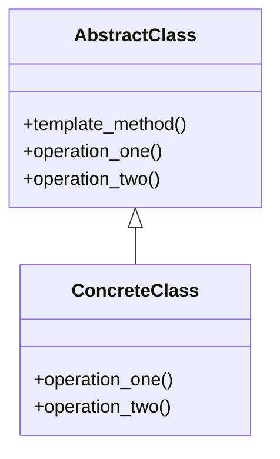

```mermaid
  classDiagram
    class AbstractClass{
      +template_method()
      +operation_one()
      +operation_two()
    }
    class ConcreteClass{
      +operation_one()
      +operation_two()
    }
    AbstractClass <|-- ConcreteClass
```

`operation_one` and `operation_two` are abstract methods of `AbstractClass` which are implemented by a `ConcreteClass` and called by the `template_method`.
